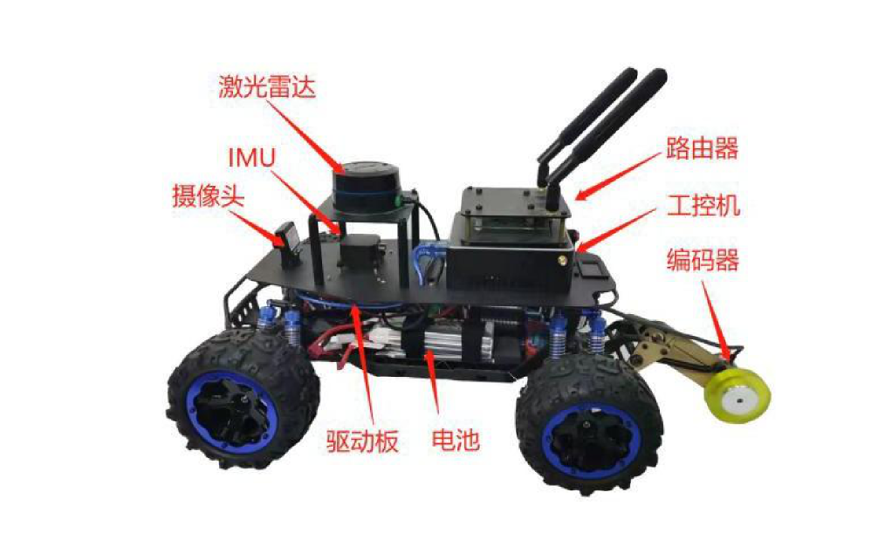

# racecar_intelligent_driving2023
# 🏎️ Autonomous Racecar Codebase
This project uses the ROS `move_base` package as the core of the autonomous navigation stack. It enables the racing car to plan and follow a safe and efficient path from the start to the goal while avoiding obstacles in real time.


---
## 📁 Configuration
```bash
${racing_car_ws}/
├── src/
│ ├── encoder_driver/ # Encoder driver for wheel odometry 
│ ├── hi226_imu/ # A ROS package for HiPNUC HI226/Hi229 IMU Device
│ ├── imu_launch/ # IMU driver launch
│ ├── imu_tool/ # ROS tools for IMU devices
│ ├── ls01b/ # A ROS package for LS01b Lidar Device
│ ├── multi_goal/ # Scripts for saving goals and sending goals.
│ ├── racecar/ # Main control node
│ ├── racecar_driver/ # Racecar chassis driver
│ ├── rf2o_laser_odometry/ # A tool for estimation of 2D odometry based on planar laser scans.
│ ├── robot_localization/ # A package of nonlinear state estimation nodes
│ ├── serial/ # Cross-platform, Serial Port library written in C++
│ └── serial_imu/ # Cross-platform with IMU
└── README.md
```
---

## 🔧 Environment

- Ubuntu-20.04 + ROS Noetic
- `robot_state_publisher`
- `ackermann_msgs`
- `controller_manager`
- `ros_control`

### 安装依赖）:

```bash
sudo apt update
sudo apt install ros-<distro>-ackermann-msgs ros-<distro>-ros-control ros-<distro>-navigation
